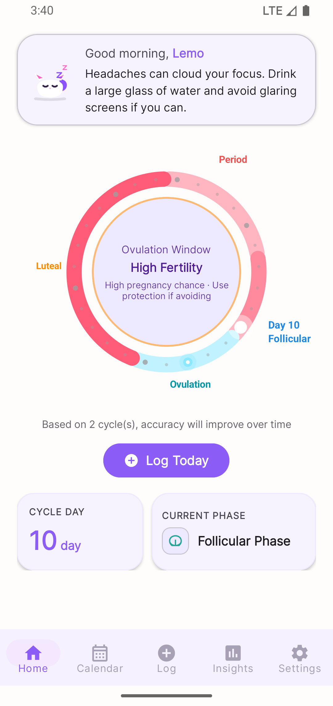
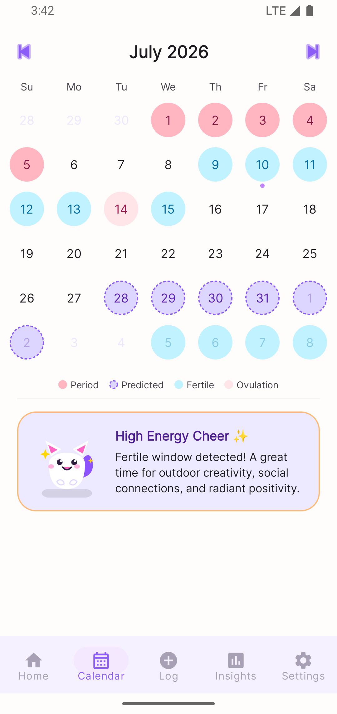
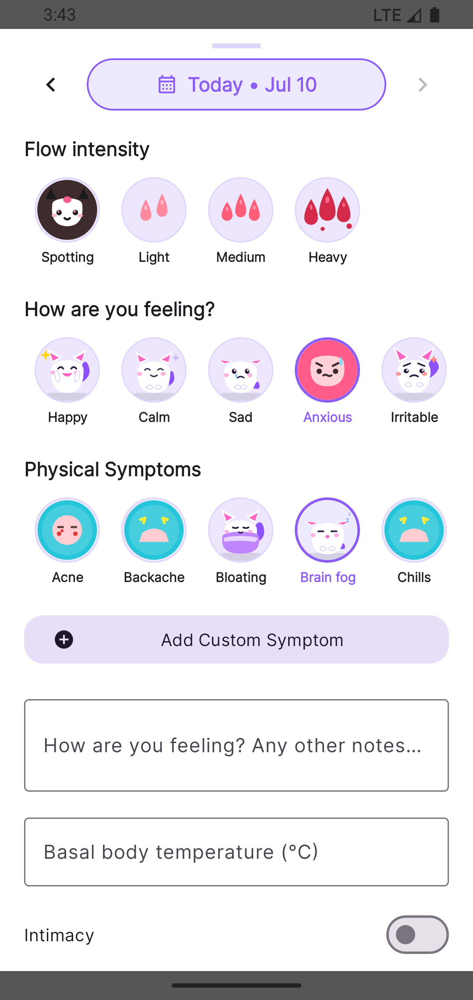
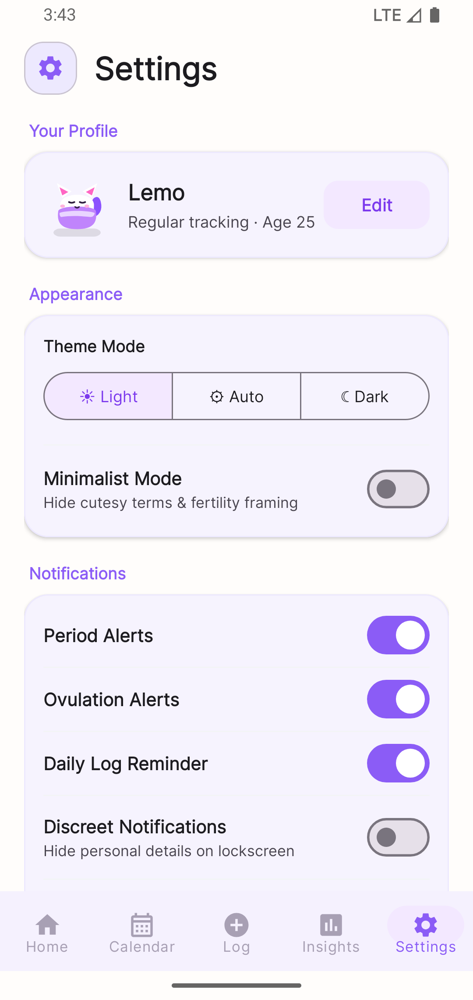
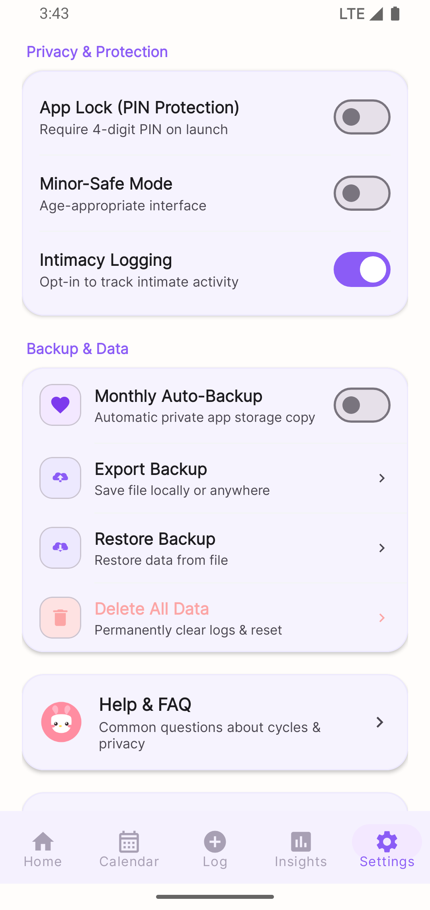
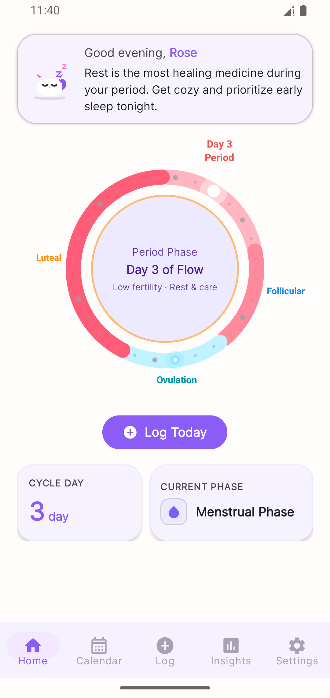
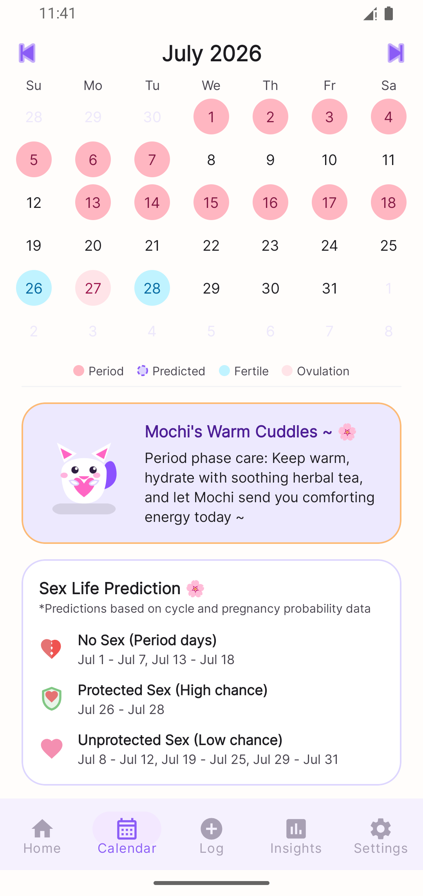
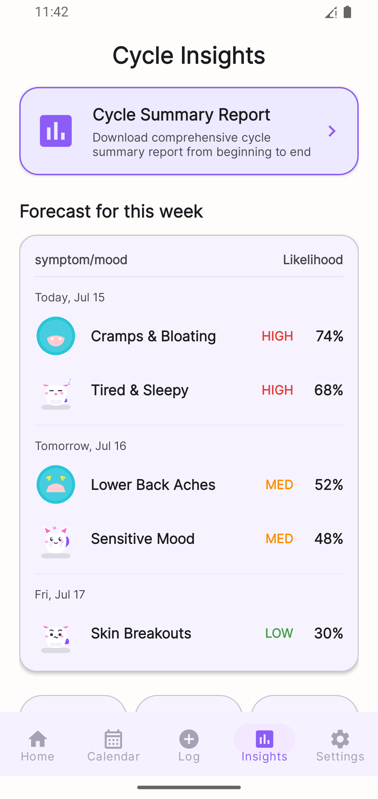
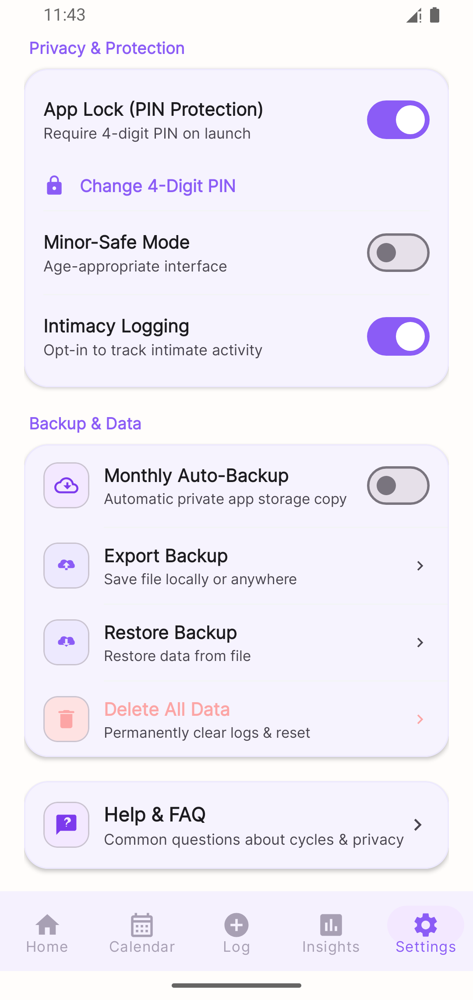

# 🌸 Cyvia – Private Period Tracker

<p align="center">
  
</p>

<p align="center">
  <b>A modern, 100% offline, privacy-first menstrual cycle, fertility, and well-being companion for Android.</b><br>
  Built with Material Design 3, powered by interactive <b>Mochi, Kitty & Bunny Avatar Companions</b>, and driven by a transparent, customizable <b>Cycle Prediction Engine</b>.
</p>

<p align="center">
  
  
  
  
  
  
  
</p>

---

## 📱 Visual Showcase & Screenshots

<div align="center">

| Home & Cycle Ring | Interactive Avatars | Multi-Month Calendar |
| :---: | :---: | :---: |
|  |  |  |

| Daily Logging Sheet | Health Insights & Analytics | PIN Lock & Security |
| :---: | :---: | :---: |
|  |  |  |

| Avatar Packs (Mochi / Kitty / Bunny) | Soft PDF Summary Export | Theme Switcher & Launcher Icons |
| :---: | :---: | :---: |
|  |  |  |

</div>

---

## 📖 Table of Contents

1. [Executive Overview](#-executive-overview)
2. [Core Architecture & Technical Stack](#-core-architecture--technical-stack)
3. [Deep-Dive Feature Breakdown](#-deep-dive-feature-breakdown)
   - [1. 100% Offline & Privacy-First Security](#1-100-offline--privacy-first-security)
   - [2. Multi-Avatar Care Mascot Engine (Mochi, Kitty, Bunny)](#2-multi-avatar-care-mascot-engine-mochi-kitty-bunny)
   - [3. Smart Prediction & Natural Day Calculation](#3-smart-prediction--natural-day-calculation)
   - [4. Interactive Canvas Cycle Ring & Dashboard](#4-interactive-canvas-cycle-ring--dashboard)
   - [5. Multi-Month Calendar & 12-Month Projections](#5-multi-month-calendar--12-month-projections)
   - [6. Comprehensive Daily Health & Symptom Logging](#6-comprehensive-daily-health--symptom-logging)
   - [7. Soft & Gentle Cycle & Wellness PDF Summary](#7-soft--gentle-cycle--wellness-pdf-summary)
   - [8. Health Insights, Regularity Scoring & MPAndroidChart](#8-health-insights-regularity-scoring--mpandroidchart)
   - [9. No Vendor Lock-In: Storage Access Framework Backup & Restore](#9-no-vendor-lock-in-storage-access-framework-backup--restore)
   - [10. Biometric PIN Lock & Dynamic App Icon Disguises](#10-biometric-pin-lock--dynamic-app-icon-disguises)
   - [11. Privacy-Respecting Monetization & Premium Store](#11-privacy-respecting-monetization--premium-store)
4. [Automated Persona Verification (40 Test Suite)](#-automated-persona-verification)
5. [Project Directory Structure](#-project-directory-structure)
6. [Database Schema & Data Model](#-database-schema--data-model)
7. [Domain Algorithms & State Logic](#-domain-algorithms--state-logic)
8. [Build & Setup Guide](#-build--setup-guide)
9. [Privacy & Security Commitments](#-privacy--security-commitments)

---

## 🌟 Executive Overview

**Cyvia** is an intimate health and menstrual cycle tracking platform designed from first principles around **absolute user privacy, zero cloud exposure, and empathetic companion support**.

Unlike mainstream period trackers that monetize by transmitting sensitive reproductive data to remote servers or third-party data brokers, Cyvia guarantees:
* **Zero Cloud Dependency**: Operates 100% offline. No signups, no email addresses, no accounts, and no remote databases.
* **Local Sandboxed Storage**: Health records, symptoms, moods, intimate logs, and notes are securely stored in local SQLite via Android Room.
* **Empathetic Companion Experience**: Features 3 interactive mascot packs (**Mochi**, **Kitty**, and **Bunny**) with responsive emotional states, physical touch reactions, and time/phase-contextual care advice.
* **Transparent Science**: Open, customizable prediction algorithms that adapt to irregular cycles, contraception, postpartum recovery, perimenopause, and trying-to-conceive (TTC) modes without misleading false precision.

---

## 🏗️ Core Architecture & Technical Stack

Cyvia is built on modern Android Architecture Components using the **Model-View-ViewModel (MVVM)** and **Repository** patterns.

```
┌─────────────────────────────────────────────────────────────────────────┐
│                             UI Layer                                    │
│  [Activities] MainActivity, OnboardingActivity, PinLockActivity         │
│  [Fragments]  HomeFragment, CalendarFragment, InsightsFragment,         │
│               DailyLogBottomSheet, SettingsFragment, PremiumFragment    │
│  [Custom UI]  CycleRingView (Canvas Drawing), CalendarAdapter           │
└────────────────────────────────────┬────────────────────────────────────┘
                                     │ Observes LiveData / Triggers Events
┌────────────────────────────────────▼────────────────────────────────────┐
│                          ViewModel Layer                                │
│  HomeViewModel, CalendarViewModel, InsightsViewModel                    │
└────────────────────────────────────┬────────────────────────────────────┘
                                     │ Queries & Coordinates
┌────────────────────────────────────▼────────────────────────────────────┐
│                           Domain Engines                                │
│  PredictionEngine       - Rolling average, late period & fertility calc │
│  MochiCareEngine        - Context-aware daily empathy advice generator  │
│  CycleStatsCalculator   - Regularity score (0-100) & cycle analytics    │
└────────────────────────────────────┬────────────────────────────────────┘
                                     │ Reads & Writes Data
┌────────────────────────────────────▼────────────────────────────────────┐
│                          Repository Layer                               │
│  CycleRepository, LogRepository, SymptomRepository, SettingsRepository  │
└───────────────────┬─────────────────────────────────┬───────────────────┘
                    │                                 │
┌───────────────────▼─────────────┐   ┌───────────────▼───────────────────┐
│     Room Database (SQLite)      │   │    Encrypted / Private Storage    │
│  - CycleEntry (Start/End dates) │   │  - SharedPreferences (Settings)   │
│  - DailyLog (Symptoms/Mood/Sex) │   │  - Sandboxed JSON Auto-Backups    │
│  - SymptomTag (Custom tags)     │   │  - SAF JSON Export & Import       │
└─────────────────────────────────┘   └───────────────────────────────────┘
```

### Technology Matrix

| Category | Component / Library | Version | Role in Cyvia |
| :--- | :--- | :--- | :--- |
| **Language** | **Java 17** | 17 | Core language with Core Library Desugaring for `java.time` backport to API 24+. |
| **Target SDK** | **Android 15 (API 35)** | 35 | Modern Android runtime compatibility and system edge-to-edge support. |
| **Min SDK** | **Android 7.0 (API 24)** | 24 | Broad hardware compatibility across over 95% of active Android devices worldwide. |
| **Database** | **Room Database** | 2.6.1 | Type-safe SQLite object relational mapping with reactive LiveData DAOs. |
| **Concurrency** | **Executors & Guava** | 32.1.3 | Dedicated background thread execution for Room and ListenableFuture worker bindings. |
| **Background Jobs**| **WorkManager** | 2.9.0 | Battery-optimized, guaranteed background scheduling for local reminders and auto-backups. |
| **Serialization** | **Google Gson** | 2.10.1 | Type-safe JSON serialization/deserialization for Storage Access Framework backups. |
| **Visual Charts** | **MPAndroidChart** | 3.1.0 | Offline interactive bar charts, line graphs, and mood/symptom distribution charts. |
| **UI Components** | **Material Design 3** | 1.12.0 | MaterialCardView, Dynamic Colors, ShapeableImageViews, and BottomSheetDialogs. |
| **Monetization** | **Play Services Ads** | 23.2.0 | Privacy-compliant persistent banner ads and user-initiated rewarded video unlocks. |
| **Billing** | **Google Play Billing**| 6.2.1 | Non-consumable in-app purchase flow for permanent "Remove Ads" & Premium unlocking. |

---

## 🚀 Deep-Dive Feature Breakdown

---

### 1. 100% Offline & Privacy-First Security
* **Zero Network Requirements for Core Functionality**: All cycle calculations, logging, insights, calendar renderings, and backup restorations execute entirely on-device without network calls.
* **App PIN & Biometric Lock**: Built-in 4-digit PIN verification (`PinLockActivity`) featuring secure salt + SHA-256 hash storage and biometric fingerprint/face authentication.
* **Prevent Unintended Cloud Leaks**: Configured with `android:allowBackup="false"`, `dataExtractionRules`, and `fullBackupContent` rules to block unencrypted automated OS cloud syncs from uploading health records to Google Drive.
* **Sandboxed Internal Storage**: Local auto-backups write directly to `context.getFilesDir()/CyviaBackups/`, completely isolated from other apps.

---

### 2. Multi-Avatar Care Mascot Engine (Mochi, Kitty, Bunny)
Cyvia includes 3 full avatar packs (**Mochi**, **Kitty**, and **Bunny**) that adapt to your mood, cycle phase, and physical condition:

| State | Evaluation Logic | Mochi Vector | Kitty Vector | Bunny Vector | Tap Reaction |
| :--- | :--- | :--- | :--- | :--- | :--- |
| **Sleeping** | Night hours (10:00 PM – 6:00 AM) | `ic_mochi_sleeping` | `ic_kitty_sleeping` | `ic_bunny_sleeping` | Gentle breathing animation + nighttime greeting. |
| **Sick** | Cramps, headache, back pain, or nausea logged | `ic_mochi_sick` | `ic_kitty_symptom_sick` | `ic_bunny_symptom_sick` | Soothing sway animation + warm healing tea message. |
| **Celebrating** | 30-day streak or period concluded | `ic_mochi_celebrating` | `ic_kitty_celebrating` | `ic_bunny_celebrating` | Joyful bouncy animation + celebration cheering. |
| **Worried** | No logs recorded for 7+ days | `ic_mochi_worried` | `ic_kitty_worried` | `ic_bunny_worried` | Shiver animation + gentle check-in nudge. |
| **Happy** | Daily log completed today | `ic_mochi_smiling` | `ic_kitty_mood_happy` | `ic_bunny_mood_happy` | Floating bounce + affectionate message. |
| **Phase Fallback**| Default cycle phase display | Phase icons | Themed Kitty icons | Themed Bunny icons | Cycle-phase tailored wellness advice. |

* **Interactive Touch Reactions**: Tapping any avatar triggers a squash-and-stretch physical deformation (`scaleX` 1.18f, `scaleY` 0.85f before springing back to 1.0f) accompanied by a contextual toast message.

---

### 3. Smart Prediction & Natural Day Calculation
The `PredictionEngine` delivers scientifically grounded calculations:
* **Natural Day Counting**: Accurately tracks elapsed cycle days (e.g. Day 23 of 24) without artificial modulo wrapping.
* **Single-Tap "No" Correction**: If a period start is accidentally confirmed or if period is not started on the predicted day, selecting "No" erases the accidental entry without creating phantom cycles.
* **Rolling Weighted Average Algorithm**: Calculates average cycle and period lengths from historical `CycleEntry` records.
* **Intelligent Outlier & Gap Filtering**: Automatically excludes cycles with gaps > 90 days caused by pregnancy, birth control, travel, or logging breaks.
* **7 Specialized Tracking Modes**:
  1. `Regular`: Standard 21–35 day cycles.
  2. `Irregular`: Uses wider standard deviation confidence intervals.
  3. `Trying to Conceive (TTC)`: Highlights peak fertile windows and ovulation days.
  4. `Avoiding Pregnancy`: Emphasizes abstinence/protection windows.
  5. `No Periods (Contraception)`: Suppresses fertile window and pregnancy messaging.
  6. `Postpartum`: Accommodates post-pregnancy cycle recalibration.
  7. `Perimenopause`: Provides flexible symptom logging and cycle irregularity tracking.

---

### 4. Interactive Canvas Cycle Ring & Dashboard
* **Custom Canvas Circular Dial (`CycleRingView`)**: Custom-drawn view rendering:
  * Smooth anti-aliased gradient arcs.
  * Period duration segment (crimson red / soft coral).
  * Follicular phase segment (warm pink).
  * Fertile window & ovulation peak indicator (vibrant purple).
  * Luteal phase segment (soothing lavender).
  * Animated pulsing dot marking the current cycle day.
* **Discreet Minimal Mode**: Instant toggle in settings to hide fertility percentages, pregnancy odds, and mascot banners for private usage in public spaces.
* **Actionable Headline Status**: Displays real-time cycle status (*"Period in X days"*, *"Period Expected Today"*, *"Period Expected Tomorrow"*, *"Period X days late"*).

---

### 5. Multi-Month Calendar & 12-Month Projections
* **Multi-Month Projection**: Projects confirmed and predicted cycle phases up to **12 months** in advance (`CalendarFragment`).
* **Color-Coded Day Dots**:
  * 🔴 Confirmed Period Days & Bleeding Flow intensity dots.
  * 🟣 Predicted Future Periods.
  * 🟢 Fertile Window & Ovulation Days.
  * ⚪ Logged Days (Moods, Symptoms, Notes).
* **Calendar Sex Life Predictor Card**: Categorizes days into **No Sex** (active period), **Protected Sex** (fertile window), and **Unprotected Sex** (low-risk days).

---

### 6. Comprehensive Daily Health & Symptom Logging
Cyvia's `DailyLogBottomSheet` delivers an organized, un-selected logging experience:
* **Flow Intensity**: `No Flow`, `Spotting`, `Light`, `Medium`, and `Heavy`.
* **How are you feeling?**: 11 Expressive Moods (`Normal`, `Happy`, `Sad`, `Calm`, `Anxious`, `Energetic`, `Sensitive`, `Romantic`, `Lonely`, `Mood Swing`, `Food Craving`).
* **Physical Condition (13 Curated Conditions)**: Guaranteed always populated with theme-aware icons for *Everything is fine, White discharge, Cramps, Acne, Bloating, Headache, Back pain, Shoulder pain, Dizziness, Breast pain, Nausea, Fatigue, Fever*, plus user-created custom symptoms.
* **Medicine & Contraception**: Dedicated *Take Pill* toggle.
* **Vaginal Discharge**: `Excessive White`, `Smelly`, `Creamy Texture`, `Watery Texture`, `Brownish`, `Yellowish`.
* **Physical Activity & Workouts**: `No Exercise`, `Running`, `Cycling`, `Gym`, `Yoga`, `Walking`, `Swimming`.
* **Intimacy & Sexual Health**: `Protected Sex`, `Unprotected Sex`, `High Libido`, `Masturbation`, `No Sex` (automatically omitted in Minor-Safe mode).
* **Vitals & Notes**: Basal Body Temperature (`°C` / `°F`), Weight (`kg` / `lbs`), and freeform private personal notes.

---

### 7. Soft & Gentle Cycle & Wellness PDF Summary
Generate a comprehensive, beautifully styled PDF export from the Insights screen:
* **Soft, Warm Aesthetic Phrasing**: Completely eliminates cold clinical/medical terminology (*"Cyvia Cycle & Wellness Summary"*, *"Personal Notes"*, *"Cycle & Rhythm Overview"*).
* **Complete Multi-Dimensional Data Tables**:
  1. *Cycle & Rhythm Overview* (Total cycles, avg cycle length, regularity score, bleed duration).
  2. *Cycle History & Flow Intensity* (Start date, end date, duration, flow badges).
  3. *Symptoms & Mood Distribution* (Occurrences of physical conditions and emotional moods).
  4. *Lifestyle, Medicine & Wellness Tracking* (Pill intake days, discharge types, exercise frequency, intimacy log).
  5. *Detailed Chronological Daily Log* (Full date-by-date breakdown with notes, BBT, and vitals).
* **Instant Export & Direct PDF Viewer Launch**: Automatically saves to local cache and opens with Android's system PDF viewer/share chooser, alongside standard Print Spooler support.

---

### 8. Health Insights, Regularity Scoring & MPAndroidChart
* **Cycle Regularity Score (0–100)**: Evaluates cycle variance using statistical standard deviation ($\sigma$). Lower variance yields a higher regularity score.
* **Interactive MPAndroidChart Visualizations**:
  * *Cycle Length History Bar Chart*: Historical cycle durations compared against user averages.
  * *Mood Distribution Chart*: Frequency analysis of emotional states across cycles.
  * *Symptom Frequency Chart*: Recurring physical patterns and condition logs.

---

### 9. No Vendor Lock-In: Storage Access Framework Backup & Restore
* **Storage Access Framework (SAF) JSON Export**: Exports your entire database into a clean, human-readable, schema-validated JSON document.
* **Anywhere Storage Destination**: Save your backup file to Google Drive, USB OTG, SD Card, Nextcloud, local Downloads, or share via secure messaging.
* **Automated Background Backup**: `AutoBackupWorker` runs periodically to ensure health data is preserved.
* **One-Click Restore**: Validates and restores complete health histories instantly.

---

### 10. Biometric PIN Lock & Dynamic App Icon Disguises
* **Customizable Launcher Icons**: Switch the app icon dynamically from Settings using Android `activity-alias` declarations without reinstalling:
  * 🌸 **Default Blossom** (`ic_launcher`)
  * 💖 **Kawaii Pink** (`ic_launcher_pink`)
  * 🍃 **Refreshing Mint** (`ic_launcher_mint`)
  * 🌊 **Serene Ocean** (`ic_launcher_ocean`)
* **Biometric & PIN Authentication**: Cold-start and background-resume app security.

---

### 11. Privacy-Respecting Monetization & Premium Store
* **100% Ad-Free Logging Guarantee**: No interstitial popups or full-screen video ads will ever interrupt health logging.
* **Persistent Bottom Banners**: Small, unobtrusive banner ads confined to the bottom of the Home and Calendar tabs.
* **Rewarded Video Unlocks**: Optional rewarded ads for unlocking multi-month future calendar projections and PDF summaries.
* **Premium In-App Purchase**: One-time Google Play Billing purchase to permanently unlock all themes, unlimited custom symptoms, advanced PDF reports, and remove all ads.

---

## 🧪 Automated Persona Verification

Cyvia is tested against a comprehensive 40-test automated persona suite covering diverse reproductive and life scenarios:

| Persona | Scenario Tested | Key Test Verification |
| :--- | :--- | :--- |
| **Persona 1: Regular 28-Day** | Standard biological rhythm | Accurate 28-day predictions, fertile window, regularity score 100/100. |
| **Persona 2: Irregular Cycles** | Variable 23–45 day cycles | Gap filtering, wider confidence intervals, non-corrupted averages. |
| **Persona 3: Trying to Conceive** | Ovulation focus | Prominent peak fertility markers, high-chance intimacy guidance. |
| **Persona 4: Hormonal Contraception**| No bleeding / pill intake | Pill tracking, suppression of fertile windows and pregnancy warnings. |
| **Persona 5: Postpartum & Perimenopause** | Cycle hiatus & fluctuations | >90-day gap exclusion, symptom tracking (hot flashes, night sweats). |
| **Persona 6: Late Period & Undo** | Delayed period & mistaken logs | Single-tap "No" correction, natural day increment, zero phantom cycles. |

```bash
# Run the automated persona test suite:
.\gradlew.bat runPersonaTests
```

---

## 📁 Project Directory Structure

```text
com.khatibstudio.cyvia
├── CyviaApplication.java            # App lifecycle, singletons, repository wiring & AdMob init
├── MainActivity.java                # Single-activity host with bottom navigation & app-lock listener
│
├── ads/
│   └── AdManager.java               # AdMob banner and rewarded video manager
│
├── backup/
│   └── BackupManager.java           # SAF JSON export, schema validation, import & auto-backup
│
├── billing/
│   └── BillingManager.java          # Google Play Billing v6 wrapper for Remove Ads purchase
│
├── data/
│   ├── db/
│   │   ├── CyviaDatabase.java       # Room Database configuration (Version 2)
│   │   ├── converter/               # Room TypeConverters for Enums, Date, and String lists
│   │   ├── dao/
│   │   │   ├── CycleEntryDao.java   # Cycle start/end dates, flow days, and historical queries
│   │   │   ├── DailyLogDao.java     # Daily logs, symptoms, moods, intimacy, and stats queries
│   │   │   └── SymptomTagDao.java   # Built-in and custom user-created symptom tags
│   │   └── entity/
│   │       ├── CycleEntry.java      # Room Entity: cycle_entries
│   │       ├── DailyLog.java        # Room Entity: daily_logs
│   │       └── SymptomTag.java      # Room Entity: symptom_tags
│   ├── model/
│   │   ├── CyclePrediction.java     # Prediction result model (dates, confidence, fertile window)
│   │   ├── FlowIntensity.java       # Enum: NO_FLOW, SPOTTING, LIGHT, MEDIUM, HEAVY
│   │   ├── Mood.java                # Enum: NORMAL, HAPPY, CALM, ENERGETIC, SENSITIVE, etc.
│   │   ├── SymptomCategory.java     # Enum: PHYSICAL, MOOD, CUSTOM
│   │   └── TrackingMode.java        # Enum: REGULAR, IRREGULAR, TTC, NO_PERIODS, etc.
│   └── repository/
│       ├── CycleRepository.java     # Single source of truth for cycle entries & statistics
│       ├── LogRepository.java       # Single source of truth for daily health logs
│       ├── SettingsRepository.java  # SharedPreferences manager (modes, PIN, preferences, units)
│       └── SymptomRepository.java   # Built-in and custom symptom tags provider
│
├── domain/
│   ├── CycleStatsCalculator.java    # Statistical cycle engine: Regularity Score (0-100), variances
│   ├── MochiCareEngine.java         # Dynamic care advice generator: Time/phase/symptom empathy
│   └── PredictionEngine.java        # Rolling average cycle prediction & gap filtering algorithm
│
├── ui/
│   ├── calendar/
│   │   ├── CalendarAdapter.java     # RecyclerView grid adapter for calendar days & dot indicators
│   │   ├── CalendarFragment.java    # Multi-month calendar view, sex life predictor & ad-gate
│   │   └── CalendarViewModel.java   # Calendar LiveData coordinator
│   ├── home/
│   │   ├── CycleRingView.java       # Custom Canvas view for the multi-phase animated circular dial
│   │   ├── HomeFragment.java        # Dashboard, Avatar living mascot, state animations, quick log
│   │   └── HomeViewModel.java       # LiveData bindings for current cycle, prediction, and mascot state
│   ├── insights/
│   │   ├── InsightsFragment.java    # Regularity score, MPAndroidChart charts & soft PDF summary export
│   │   └── InsightsViewModel.java   # Historical statistics coordinator
│   ├── log/
│   │   └── DailyLogBottomSheet.java # Comprehensive daily logging bottom sheet (all dimensions)
│   ├── onboarding/
│   │   ├── OnboardingActivity.java  # Multi-step welcome, cycle parameters & tracking mode setup
│   │   └── ...                      # Onboarding step fragments and ViewPager adapter
│   ├── pin/
│   │   └── PinLockActivity.java     # Secure PIN lock screen, keypad input & biometric verification
│   └── settings/
│       ├── FaqFragment.java         # Built-in searchable FAQ guide
│       ├── PremiumFragment.java     # Remove Ads upgrade screen & Play Billing trigger
│       ├── ProfileEditFragment.java # Name, cycle parameters, and tracking mode editor
│       └── SettingsFragment.java    # App configuration, themes, PIN setup, icon switcher & backups
│
├── util/
│   └── KawaiiIconUtil.java          # Mascot asset resolver (Mochi, Kitty, Bunny) & icon loaders
│
└── worker/
    ├── AutoBackupWorker.java        # Periodic background auto-backup worker
    ├── BootReceiver.java            # BroadcastReceiver for re-registering alarms on device reboot
    └── ReminderWorker.java          # WorkManager worker for discreet local notification delivery
```

---

## 🛠️ Build & Setup Guide

### Prerequisites
* **Android Studio**: Android Studio Ladybug (2024.2+) or newer.
* **Java Development Kit (JDK)**: JDK 17 (bundled with Android Studio).
* **Android SDK**: Platform SDK 35 (Android 15), Build-Tools 35.0.0.

### Step-by-Step Compilation

1. **Clone the Repository**:
   ```bash
   git clone https://github.com/AbrarBb/Cyvia.git
   cd Cyvia
   ```

2. **Open in Android Studio**:
   * Launch Android Studio, choose **Open**, and select the project root folder.
   * Allow Gradle to sync dependencies.

3. **Build the Debug APK**:
   ```bash
   # On Windows (PowerShell / Command Prompt)
   .\gradlew.bat assembleDebug

   # On macOS / Linux
   ./gradlew assembleDebug
   ```

4. **Run Automated Persona Tests**:
   ```bash
   .\gradlew.bat runPersonaTests
   ```

### AdMob Test Configuration
The project is configured out-of-the-box with Google's official AdMob test identifiers:
* **App ID**: `ca-app-pub-3940256099942544~3347511713`
* **Banner Unit ID**: `ca-app-pub-3940256099942544/6300978111`
* **Rewarded Unit ID**: `ca-app-pub-3940256099942544/5224354917`

> [!IMPORTANT]
> **Production Release**: Replace the test IDs in `app/build.gradle` (`admobAppId`) and `AdManager.java` (`BANNER_AD_UNIT_ID`, `REWARDED_AD_UNIT_ID`) with your real Google AdMob publisher IDs prior to publishing to the Google Play Store.

---

## 🔒 Privacy & Security Commitments

Cyvia is architected around an uncompromising commitment to digital safety:

1. **No Account Required**: Users never provide an email address, name, phone number, or social login.
2. **Local-First Architecture**: Biological data lives strictly in your device's internal storage sandbox.
3. **No Hidden Telemetry**: Zero third-party analytics trackers, crash loggers with data payloads, or user profiling SDKs.
4. **Data Portability**: Full ownership of your data via open Storage Access Framework JSON export.
5. **Permanent Destruction**: Tapping "Delete All Data" in Settings performs an irreversible cascade wipe across all Room SQLite tables and shared preference files.

---

<p align="center">
  Crafted with care, privacy, and empathy by <b>Khatib Studio</b>.
</p>
